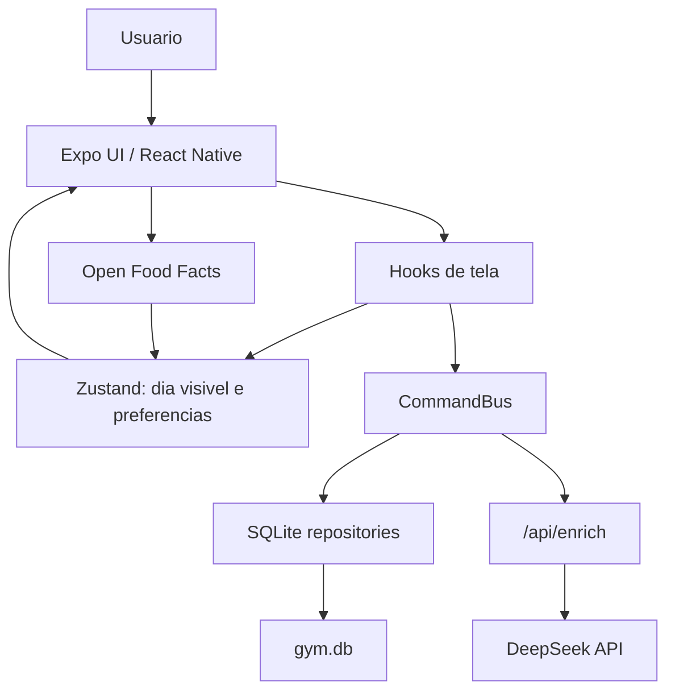

# Arquitetura

## Visao Geral

O app e local-first. A fonte persistente e `gym.db` no telefone. A store guarda
so o dia visivel de cada dominio para manter memoria baixa e UI responsiva.

## Camadas

| Camada | Pasta | Responsabilidade |
| --- | --- | --- |
| Rotas | `src/app` | Entradas do Expo Router e endpoint `/api/enrich`. |
| Templates | `src/components/templates` | Composicao de telas inteiras. |
| Organisms | `src/components/organisms` | Sheets, camera, lista, totais, detalhes. |
| Molecules/Atoms | `src/components/molecules`, `src/components/atoms` | UI reutilizavel menor. |
| Hooks | `src/hooks` | Ligacao entre UI, store e repositorios. |
| Core | `src/core` | Comandos, datas, IA client, utilitarios, onboarding e Open Food Facts. |
| Domains | `src/domains` | Schemas, prompts e logica pura de comida/treino. |
| Data | `src/data` | SQLite e repositories. |
| Store | `src/store` | Estado de app e preferencias. |
| i18n | `src/i18n` | Dicionario simples pt-BR/en-US. |

## Padrao de Dominio

`DomainConfig<TData, TTotals>` permite que dieta e treino usem o mesmo
`DayTemplate`.

Cada dominio define:

- `id`: `food` ou `workout`.
- `title` e `placeholder`.
- `accent`: cor principal.
- `schema`: schema Zod que valida a resposta.
- `formatResult`: resumo de uma entrada resolvida.
- `emptyTotals`, `addToTotals`, `describeTotals`: totalizadores do dia.

Com isso, `DayTemplate` renderiza lista, header, footer, totais, undo e
persistencia para ambos os dominios. Comida tem fluxos extras para midia,
barcode e detalhes nutricionais.

## Persistencia

`src/data/db.ts` abre um unico banco `gym.db` com:

- `entries`: notas de comida e treino.
- `settings`: chave-valor para tema, idioma e onboarding.
- `saved_meals`: refeicoes salvas.

`EntryRepository` valida `data` ao ler. Se uma row antiga estava `done`, mas o
JSON nao valida mais, ela volta como `error` para poder ser refeita em vez de
quebrar a UI.

## Estado

`useAppStore` guarda:

- `food` e `workout`: dia visivel e entradas desse dia.
- `theme`, `lang`, `prefsLoaded`.
- `onboardingDone`, `onboardingProfile`.

O store nao tenta guardar historico completo. Ao trocar de dia, `useDay`
consulta SQLite e troca apenas a lista visivel.

## Comandos

`CommandBus` centraliza efeitos de entrada:

- `addEntry`
- `deleteEntry`
- `editEntry`
- `retry`
- `undo`

Ele cria entradas em `thinking`, salva localmente, chama IA quando necessario,
aplica cache LRU, faz backoff em falha de rede e atualiza repository + store.

Comida com foto/barcode tem caminho especial em `DayTemplate`, porque precisa
juntar dados de Open Food Facts, imagens, descricoes e nota em um unico
resultado.

## IA

Cliente:

- `src/core/enrich/client.ts` chama `/api/enrich`.
- Timeout: 20 segundos.
- Base URL: `EXPO_PUBLIC_API_URL`, senao host do Metro, senao localhost.

Servidor:

- `src/app/api/enrich+api.ts` valida payload com Zod.
- Gera descricoes de imagens quando necessario.
- Monta prompt por dominio.
- Chama DeepSeek.
- Valida resposta no servidor e o cliente valida de novo antes de aplicar.

## UI Nativa iOS

`src/components/onboarding/onboardingNative.ts` carrega `@expo/ui/swift-ui`
apenas quando:

- plataforma e iOS;
- modulo `ExpoUI` existe;
- require dinamico funciona.

Se nao existir, o app cai para componentes React Native normais. Isso evita
quebrar Expo Go ou plataformas sem Expo UI.

Hoje o uso nativo aparece em:

- onboarding: botoes, sheets, pickers e toggles quando disponivel;
- menu de detalhes nutricionais: `SwiftMenu` para comportamento proximo de iOS.

## Temas e Cores

`src/constants/theme.ts` define tokens de light/dark:

- calories: laranja.
- protein: verde.
- carbs: roxo.
- fat: amarelo.
- water: azul claro.

Os totais e inputs usam estes tokens; numeros principais ficam em texto do tema.

## Limites Atuais

- Login, pagamento e integracoes sao placeholders em ajustes.
- Microfone existe como botao visual, sem acao real.
- Refeicoes salvas sao persistidas, mas gerenciamento completo ainda e visual.
- Barcode depende de Open Food Facts e pode retornar valores por porcao ou por 100g/ml conforme disponibilidade.
