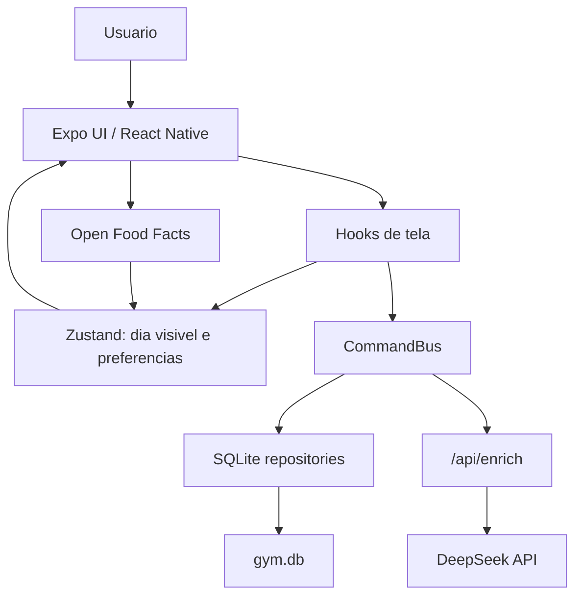

# Arquitetura

## Visao Geral

O app e local-first. A fonte persistente e `gym.db` no telefone. A store guarda
so o dia visivel de cada dominio para manter memoria baixa e UI responsiva.

## Camadas

| Camada | Pasta | Responsabilidade |
| --- | --- | --- |
| Rotas | `src/app` | Entradas do Expo Router e endpoint `/api/enrich`. |
| Templates | `src/components/templates` | Composicao de telas inteiras. |
| Organisms | `src/components/organisms` | Sheets, camera, lista, totais, detalhes. |
| Molecules/Atoms | `src/components/molecules`, `src/components/atoms` | UI reutilizavel menor. |
| Hooks | `src/hooks` | Ligacao entre UI, store e repositorios. |
| Core | `src/core` | Comandos, datas, IA client, utilitarios, onboarding e Open Food Facts. |
| Domains | `src/domains` | Schemas, prompts e logica pura de comida/treino. |
| Data | `src/data` | SQLite e repositories. |
| Store | `src/store` | Estado de app e preferencias. |
| i18n | `src/i18n` | Dicionario simples pt-BR/en-US. |

## Padrao de Dominio

`DomainConfig<TData, TTotals>` permite que dieta e treino usem o mesmo
`DayTemplate`.

Cada dominio define:

- `id`: `food` ou `workout`.
- `title` e `placeholder`.
- `accent`: cor principal.
- `schema`: schema Zod que valida a resposta.
- `formatResult`: resumo de uma entrada resolvida.
- `emptyTotals`, `addToTotals`, `describeTotals`: totalizadores do dia.

Com isso, `DayTemplate` renderiza lista, header, footer, totais, undo e
persistencia para ambos os dominios.

Cada dominio ainda tem seus fluxos exclusivos:

- comida: midia, barcode, detalhes nutricionais e metas;
- treino: outliner de series, painel de progresso/PR, exercicios salvos e o
  monitor de treino/cardio.

O dock de totais e o mesmo componente nos dois: em comida abre
`FoodGoalsSheet`, em treino abre `WorkoutProgressSheet`.

## Ajustes

`SettingsSheet.tsx` era um arquivo de 4563 linhas com quinze sheets dentro. Hoje
e so a **raiz**: le a pilha de modais, deriva qual sheet esta visivel e renderiza.
Cada sheet mora em `src/components/organisms/settings/`.

| Arquivo | Papel |
| --- | --- |
| `primitives.tsx` | Section, Divider, PageSheet, OptionMenu, Toggle — a linguagem visual dos ajustes |
| `styles.ts` | `settingsStyles` (o que 3+ sheets usam) e `savedListStyles` (a linha dos tres saved-*) |
| `goalProfile.ts` | tipo de meta, peso-alvo e rotulos de genero/atividade |
| `<Nome>Sheet.tsx` | um sheet cada, com o StyleSheet so das chaves que ele usa |

A raiz nao conhece o conteudo de nenhum sheet — passa props e a pilha decide a
visibilidade. Adicionar um sheet e um arquivo novo mais uma linha na raiz.

O que **nao** foi feito de proposito: nao existe CommandBus de ajustes. As
escritas aqui sao de um passo, sem undo e sem estado intermediario — o
`CommandBus` existe para entradas porque elas tem `thinking -> done`, retry e
desfazer. Ajustes nao tem nada disso, e a cerimonia nao pagaria por si.

## Modulos de Dominio de Treino

| Arquivo | Responsabilidade |
| --- | --- |
| `workout.ts` | parser de series/cardio, totais, formatadores |
| `anatomy.ts` | vocabulario grupamento -> musculo -> porcao, meta semanal |
| `muscles.ts` | tabela de palavras-chave, ponte para o historico sem classificacao |
| `workoutProgress.ts` | PRs do dia, para o painel da tela de treino |
| `workoutMonitor.ts` | agregacao do monitor: volume, series, cardio, streak |
| `chartScale.ts` | escala de eixo e lacunas, compartilhada pelos graficos |
| `routines.ts` | o que vira dia salvo em cada dominio |

Todos puros e testados sem SQLite nem React — a UI so renderiza o que eles
devolvem.

## Persistencia

`src/data/db.ts` abre um unico banco `gym.db` com:

- `entries`: notas de comida e treino.
- `settings`: chave-valor para tema, idioma e onboarding.
- `saved_meals`: refeicoes salvas.
- `saved_exercises` (tabela `saved_workouts`): exercicios salvos avulsos.
- `saved_routines`: dias salvos dos **dois** dominios, com `domain`, `name`,
  `weekday` opcional e `items` JSON. Uma tabela so porque a diferenca entre
  treino e dieta esta no conteudo de `items`, nao na forma.

A antiga `kind = day` em `saved_workouts` e legado: nada escreve mais, o leitor
ainda aceita.

`EntryRepository` valida `data` ao ler. Se uma row antiga estava `done`, mas o
JSON nao valida mais, ela volta como `error` para poder ser refeita em vez de
quebrar a UI.

`EntryRepository.findAll(domain)` le o historico inteiro de um dominio, fora da
regra "so o dia visivel". Existe porque comparar PR e agregar evolucao precisa
de todos os dias. Hoje so treino usa, em dois lugares: `WorkoutProgressSheet` e
o monitor de treino em ajustes. Ambos leem sob demanda ao abrir o painel, nunca
no caminho de digitacao.

Efeito que le repository precisa ser chaveado por dia, nunca por `entries`:
`entries` muda a cada upsert (cada tecla que dispara edicao, cada resolucao da
IA), e leitura de tabela nessa frequencia e desperdicio puro.

## Estado

`useAppStore` guarda:

- `food` e `workout`: dia visivel e entradas desse dia.
- `theme`, `lang`, `prefsLoaded`.
- `onboardingDone`, `onboardingProfile`.

O store nao tenta guardar historico completo. Ao trocar de dia, `useDay`
consulta SQLite e troca apenas a lista visivel.

## Comandos

`CommandBus` centraliza efeitos de entrada:

- `addEntry`
- `deleteEntry`
- `editEntry`
- `retry`
- `undo`

Ele cria entradas em `thinking`, salva localmente, chama IA quando necessario,
aplica cache LRU, faz backoff em falha de rede e atualiza repository + store.

O cache LRU (`src/core/cache/lru.ts`) **nao** e uma camada entre store e banco:
e dedupe de resultado da IA, chaveado por hash do texto + contexto. Store <-
repository <- SQLite e o caminho de leitura; o LRU so evita reprocessar uma nota
identica. Nao existe tier de cache generico, de proposito — seria estado a mais
para sincronizar sem ganho.

Duas notas nascem de uma quando o modelo devolve mais de uma acao: "comprei X e
comi Y" volta como `notes[]` e o bus explode em uma nota por acao num
`CompositeCommand` (um undo desfaz o conjunto), igual ao plano de treino que vira
uma nota por exercicio. Nota de refeicao que puxa da geladeira e vinculada e
reprecificada com o produto real em `attachPantryProvenance` antes de resolver.

Comida com foto/barcode tem caminho especial em `DayTemplate`, porque precisa
juntar dados de Open Food Facts, imagens, descricoes e nota em um unico
resultado.

## Geladeira (derivada, nunca armazenada)

Nao ha tabela de estoque. `PantryRepository.all()` = `pantryItems(EntryRepository
.findAll('food'))`: cada leitura recalcula a partir das notas de compra e das
notas de refeicao que puxaram da geladeira. Comer desconta grama; apagar a nota
apaga o desconto e o proximo recalculo devolve o estoque — sem ledger, sem
codigo de reversao. Os componentes da geladeira (`PantrySheet`,
`FoodRecipeCard`, `PantryPriceHistoryCard`, e a proveniencia no detalhe) leem o
repository sob demanda ao abrir, fora do store — mesma regra do historico de
treino, pois nao e o dia visivel e sincronizar no store nao pagaria por si.

## Observabilidade

`src/core/log.ts` e um logger unico para o terminal do `expo start`. Silencioso
em release (`__DEV__`) e sob jest (`NODE_ENV === 'test'`). A instrumentacao mora
nos pontos por onde tudo ja passa, nao espalhada por componente:

- `useAppModalStore`: toda navegacao (sheet/modal/menu/picker) com de -> para.
- `CommandBus`: ciclo de vida da nota (add/edit/delete/undo/retry/split/resolved).
- `enrich/client` + `enrich/deepseek`: request e response reais, com `usage` de
  cache do DeepSeek (hit/miss) e o corpo inteiro no erro.
- `useAppStore`, `EntryRepository`: troca de dia e escritas no banco.
- `installErrorLogging` (chamado no root): todo erro/rejeicao nao tratada.

`LoggedPressable`/`LoggedTextInput` (`src/components/atoms/Logged.tsx`) sao
drop-ins que logam tap/foco a partir do `accessibilityLabel`. Cada letra e cada
frame de scroll ficam atras de `logConfig.verbose` — firehose desligado por
padrao.

## IA

Cliente:

- `src/core/enrich/client.ts` chama `/api/enrich`.
- Timeout: 20 segundos.
- Base URL: `EXPO_PUBLIC_API_URL`, senao host do Metro, senao localhost.

Servidor:

- `src/app/api/enrich+api.ts` valida payload com Zod.
- Gera descricoes de imagens quando necessario.
- Monta prompt por dominio.
- Chama DeepSeek.
- Valida resposta no servidor e o cliente valida de novo antes de aplicar.

## UI Nativa iOS

`src/components/onboarding/onboardingNative.ts` carrega `@expo/ui/swift-ui`
apenas quando:

- plataforma e iOS;
- modulo `ExpoUI` existe;
- require dinamico funciona.

Se nao existir, o app cai para componentes React Native normais. Isso evita
quebrar Expo Go ou plataformas sem Expo UI.

Hoje o uso nativo aparece em:

- onboarding: botoes, sheets, pickers e toggles quando disponivel;
- menu de detalhes nutricionais: `SwiftMenu` para comportamento proximo de iOS;
- monitor de treino: `NativeSegmented` para as abas e os periodos, com pills RN
  como fallback.

## Temas e Cores

`src/constants/theme.ts` define tokens de light/dark:

- calories: laranja.
- protein: verde.
- carbs: roxo.
- fat: amarelo.
- water: azul claro.
- sugar / fiber / sodium: os micronutrientes. Eram os mesmos tres hexes copiados
  na sheet de metas, no detalhe e no editor de nutricao — hoje sao tokens. A
  chave da config (`key: 'sugar'`) coincide com o token, entao o render resolve
  `colors[stat.key]` sem repetir cor. Neutros por tema (iguais em light/dark)
  para preservar a aparencia; podem ganhar valor por tema se o contraste exigir.

Os totais e inputs usam estes tokens; numeros principais ficam em texto do tema.
Regra: cor repetida em 3+ lugares vira token aqui, nunca hex solto no componente.

## Limites Atuais

- Login, pagamento e integracoes sao placeholders em ajustes.
- Refeicoes salvas sao persistidas, mas gerenciamento completo ainda e visual.
- Barcode depende de Open Food Facts e pode retornar valores por porcao ou por 100g/ml conforme disponibilidade.
- Exercicio salvo guarda so o nome, nao series. Reaplicar cria linhas vazias.
- Dia salvo (`saved_routines`) so tem ida: grava e lista em Ajustes, mas nenhum
  picker aplica um treino ou dieta salvo a um dia.
- PR, monitor e evolucao de treino sao calculados na hora, lendo o historico
  completo a cada abertura do painel. Sem cache e sem tabela agregada.
- A classificacao muscular vem da IA por entrada. Historico anterior cai na
  tabela de palavras-chave de `muscles.ts`, que so acerta o grupamento — musculo
  e porcao ficam vazios e a fatia sem classificacao aparece no monitor.
- As chaves de API do usuario ficam em texto puro na tabela `settings`.
- `canOpenAppModal` e conselho, nao regra: e funcao pura que o chamador precisa
  lembrar de invocar; a store nao verifica. Mover a checagem para dentro da
  store nao e de graca — `day.root` e `onboarding.root` sao `AppModalId` mas
  nao fazem parte da uniao `AppModal`, sao raizes virtuais nunca empilhadas.
  Inferir a origem pelo topo da pilha daria `day.root` tambem no onboarding,
  quebrando os pickers dele.
- O dock de treino mostra tempo e distancia mesmo zerados em dia so de
  musculacao.
