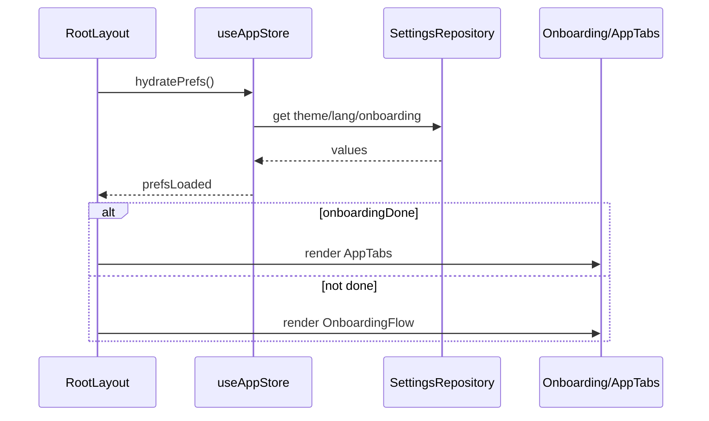
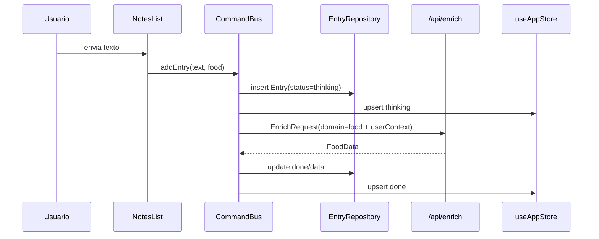
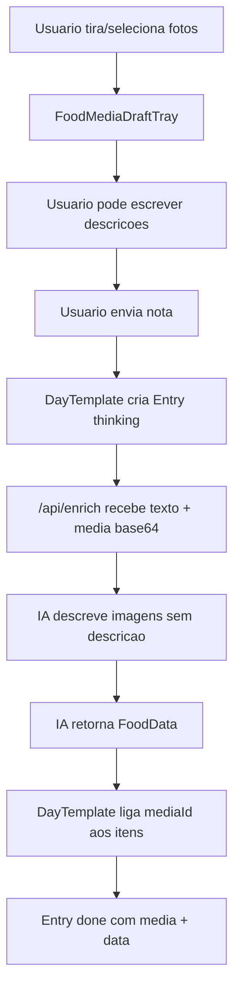
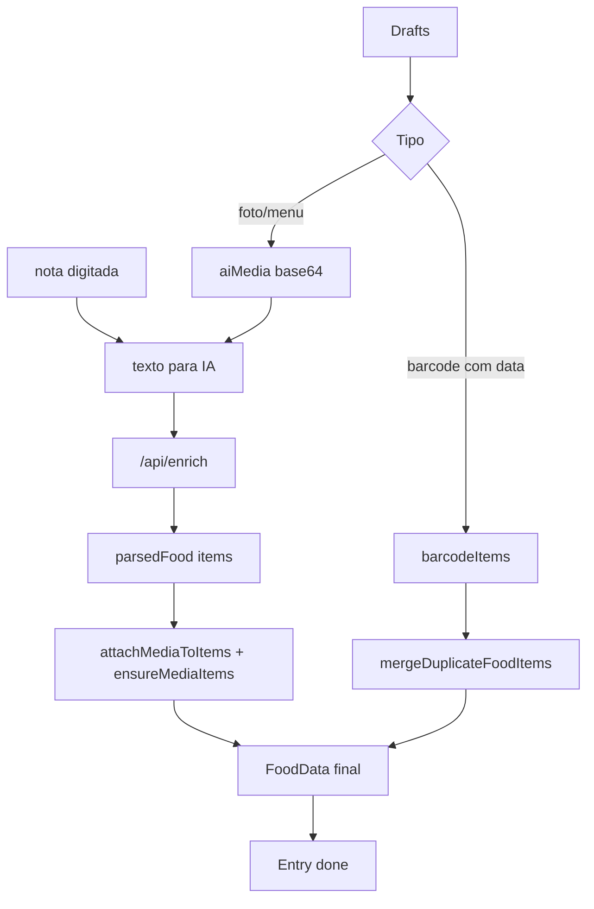
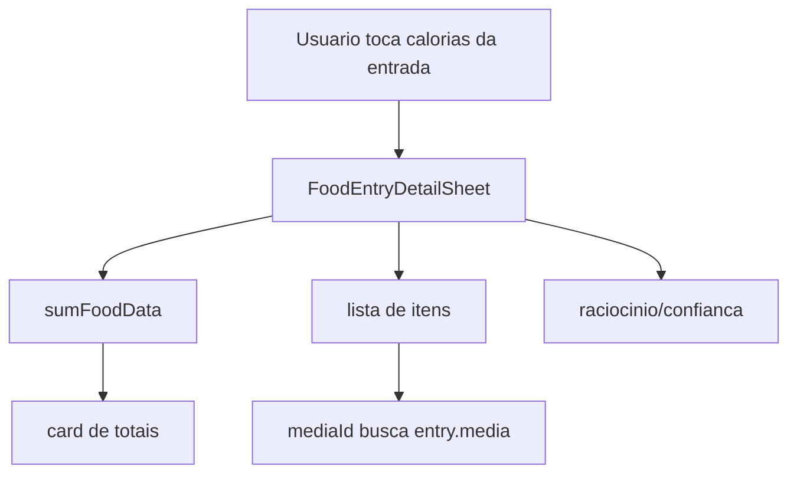
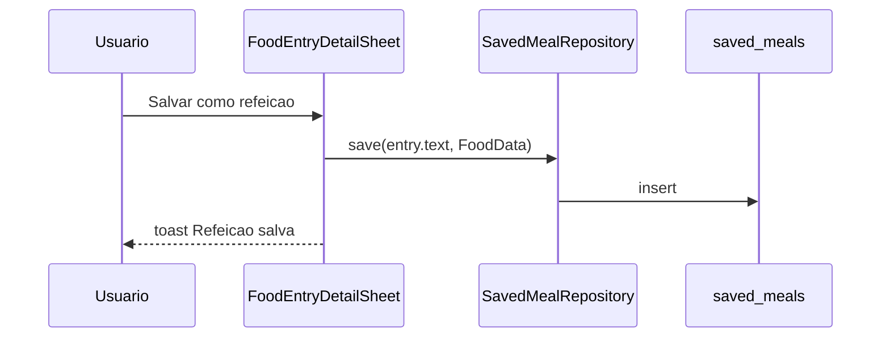
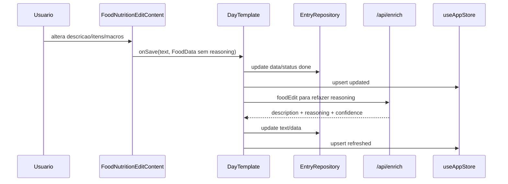
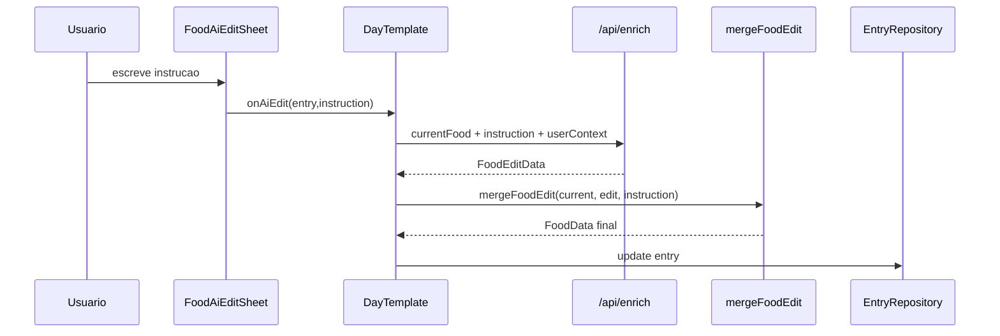
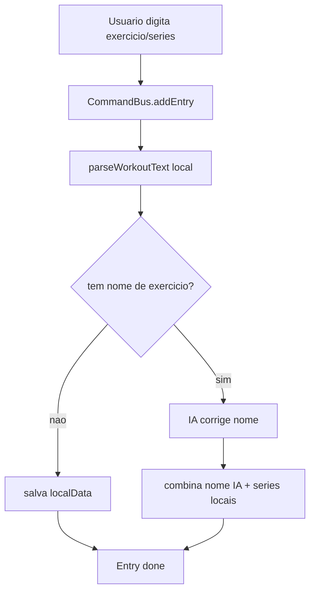

# Fluxos de Dados

## 1. Startup e Onboarding



Quando o onboarding termina:

1. `completeOnboarding(profile)` atualiza store.
2. `settings.onboarding_done = "1"`.
3. `settings.onboarding_profile = JSON.stringify(profile)`.
4. `RootLayout` troca para as tabs.

## 2. Nota de Comida Somente Texto



Erros:

- Falha de rede: `queued`, retry com backoff ate 5 tentativas.
- Erro da IA ou schema invalido: `error` com botao `tentar de novo`.

## 3. Nota de Comida com Fotos ou Cardapio



Regras:

- Texto digitado e imagens se complementam.
- A IA nao deve ignorar a nota quando existem imagens.
- Cada foto/cardapio pode virar item proprio com `mediaId`.
- Se a IA nao retorna item para uma foto, `ensureMediaItems` cria item fallback
  com macros zerados para nao perder a imagem.
- Se a IA ignora texto, `fallbackFoodItemsFromText` cria itens textuais zerados
  para nao perder a anotacao.

## 4. Codigo de Barras

```mermaid
sequenceDiagram
  participant Camera as FoodMediaCaptureSheet
  participant OFF as Open Food Facts
  participant Edit as FoodNutritionEditSheet
  participant Draft as FoodMediaDraftTray
  participant Submit as DayTemplate

  Camera->>Submit: onBarcode(code)
  Submit->>OFF: lookupOpenFoodFactsProduct(code)
  OFF-->>Submit: OpenFoodFactsFood or null
  Submit->>Edit: open barcode draft
  Edit->>Draft: save FoodMediaDraft(kind=barcode,data)
  Draft->>Submit: send with note/photos
```

Barcode e um caso separado:

- Nao manda imagem para a IA.
- Dados nutricionais vem de Open Food Facts.
- Produto vira `FoodData` com um item.
- Acucar, fibras e sodio sao importados quando Open Food Facts fornece
  nutrimentos correspondentes.
- `quantity: 1` e `unit: "unidade"` permitem mesclar produtos repetidos.
- Duas caixas iguais devem virar um item com quantidade 2, nao dois itens.

Se Open Food Facts nao encontra produto:

- O app cria item fallback `Codigo de barras <code>` com macros zerados.
- Usuario pode revisar no editor antes de anexar.

## 5. Envio Misturado: Texto + Fotos + Barcode



Objetivo do fluxo:

- Barcode ja tem macros.
- Imagens normais ganham descricao e estimativa da IA.
- Nota digitada tambem vira itens.
- Resultado final soma tudo em uma unica refeicao.

## 6. Detalhes Nutricionais



A tela nao recalcula via backend ao abrir. Ela le `entry.data`, soma no cliente e
renderiza. Quando o perfil tem micronutrientes ativos, os itens expandidos
tambem mostram acucar, fibras e/ou sodio.

## 7. Salvar Refeicao



O icone de salvar fica preenchido durante a sessao do detalhe quando a refeicao
foi salva.

## 8. Editar Manualmente



Se o usuario abrir e fechar sem mudar nada, nao deve refazer o raciocinio.
Campos de acucar/fibras/sodio aparecem nos totais e itens somente quando estao
ativos no perfil.

## 9. Editar com IA



Regras de UX:

- Input fica acima do teclado.
- Enviar nao deve fechar teclado.
- Pode aplicar multiplas edicoes em um unico prompt.
- Raciocinio deve ser refeito do zero para a refeicao final, sem mencionar "eu adicionei".
- Quando micronutrientes estao ativos, a IA deve preservar ou recalcular
  `sugarG`, `fiberG` e `sodiumMg`.

## 10. Treino



Series sao sempre calculadas localmente. A IA so ajuda a normalizar nome do
exercicio quando necessario.

## 11. Undo e Retry

Undo:

1. Delete chama `CommandBus.deleteEntry`.
2. Entrada sai do repository e da store.
3. `UndoToast` aparece por 4 segundos.
4. Undo re-insere a entrada anterior.

Retry:

1. Entrada em `error` mostra `tentar de novo`.
2. Tap limpa tentativas e status vira `thinking`.
3. `CommandBus` reexecuta enriquecimento.
