# Fluxos de Dados

## 1. Startup e Onboarding

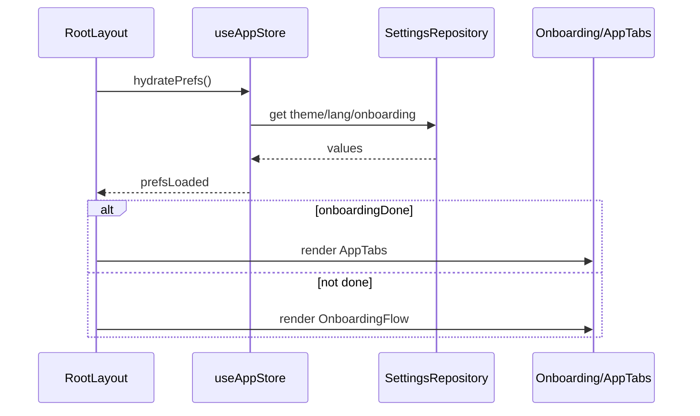

Quando o onboarding termina:

1. `completeOnboarding(profile)` atualiza store.
2. `settings.onboarding_done = "1"`.
3. `settings.onboarding_profile = JSON.stringify(profile)`.
4. `RootLayout` troca para as tabs.

## 2. Nota de Comida Somente Texto

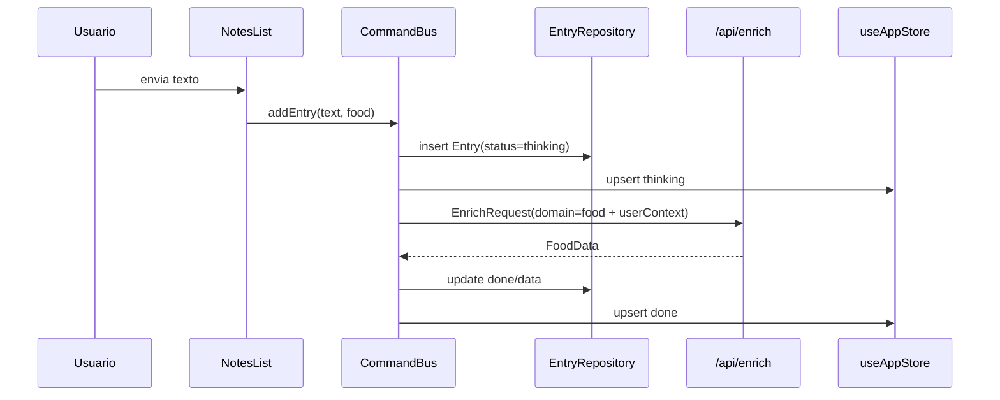

Erros:

- Falha de rede: `queued`, retry com backoff ate 5 tentativas.
- Erro da IA ou schema invalido: `error` com botao `tentar de novo`.

## 3. Nota de Comida com Fotos ou Cardapio

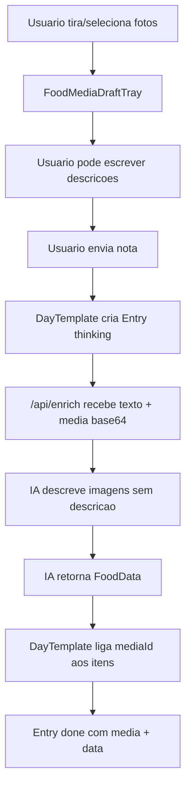

Regras:

- Texto digitado e imagens se complementam.
- A IA nao deve ignorar a nota quando existem imagens.
- Cada foto/cardapio pode virar item proprio com `mediaId`.
- Se a IA nao retorna item para uma foto, `ensureMediaItems` cria item fallback
  com macros zerados para nao perder a imagem.
- Se a IA ignora texto, `fallbackFoodItemsFromText` cria itens textuais zerados
  para nao perder a anotacao.

Falha da IA (rede caiu, resposta nao valida) e caso separado dos fallbacks
acima:

- sem barcode, a entrada vira `error` — nao existe numero real para salvar, e
  gravar `done` com tudo zerado seria um almoco de 0 kcal somando no dia;
- com barcode, continua `done`: os itens do barcode sao dado real;
- entrada com midia em `error` **nao** oferece "tentar de novo". `runEnrich` so
  reenvia `text`, entao o retry reconstruiria a refeicao sem as fotos. A UI
  mostra `falhou` e o usuario refaz a nota.

## 4. Codigo de Barras

```mermaid
sequenceDiagram
  participant Camera as FoodMediaCaptureSheet
  participant OFF as Open Food Facts
  participant Edit as FoodNutritionEditSheet
  participant Draft as FoodMediaDraftTray
  participant Submit as DayTemplate

  Camera->>Submit: onBarcode(code)
  Submit->>OFF: lookupOpenFoodFactsProduct(code)
  OFF-->>Submit: OpenFoodFactsFood or null
  Submit->>Edit: open barcode draft
  Edit->>Draft: save FoodMediaDraft(kind=barcode,data)
  Draft->>Submit: send with note/photos
```

Barcode e um caso separado:

- Nao manda imagem para a IA.
- Dados nutricionais vem de Open Food Facts.
- Produto vira `FoodData` com um item.
- Acucar, fibras e sodio sao importados quando Open Food Facts fornece
  nutrimentos correspondentes.
- `quantity: 1` e `unit: "unidade"` permitem mesclar produtos repetidos.
- Duas caixas iguais devem virar um item com quantidade 2, nao dois itens.

Se Open Food Facts nao encontra produto:

- O app cria item fallback `Codigo de barras <code>` com macros zerados.
- Usuario pode revisar no editor antes de anexar.

## 5. Envio Misturado: Texto + Fotos + Barcode

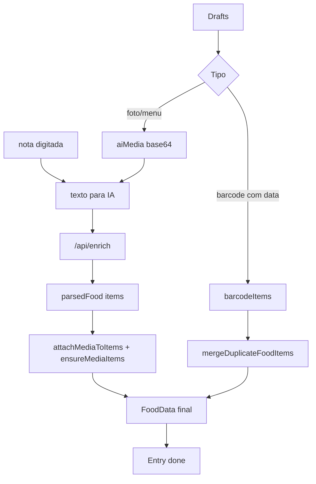

Objetivo do fluxo:

- Barcode ja tem macros.
- Imagens normais ganham descricao e estimativa da IA.
- Nota digitada tambem vira itens.
- Resultado final soma tudo em uma unica refeicao.

## 6. Detalhes Nutricionais

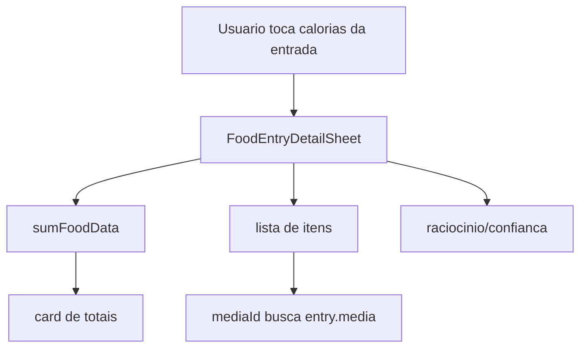

A tela nao recalcula via backend ao abrir. Ela le `entry.data`, soma no cliente e
renderiza. Quando o perfil tem micronutrientes ativos, os itens expandidos
tambem mostram acucar, fibras e/ou sodio.

## 7. Salvar Refeicao

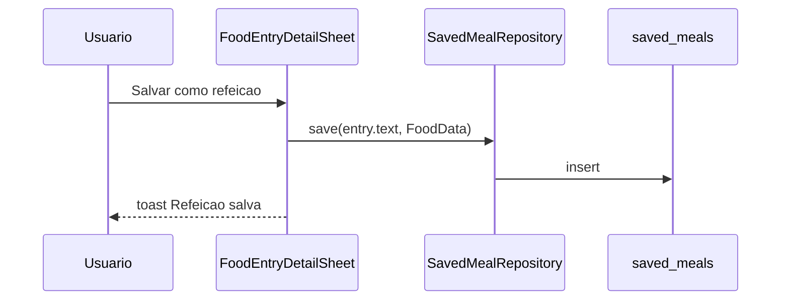

O icone de salvar fica preenchido durante a sessao do detalhe quando a refeicao
foi salva.

## 8. Editar Manualmente

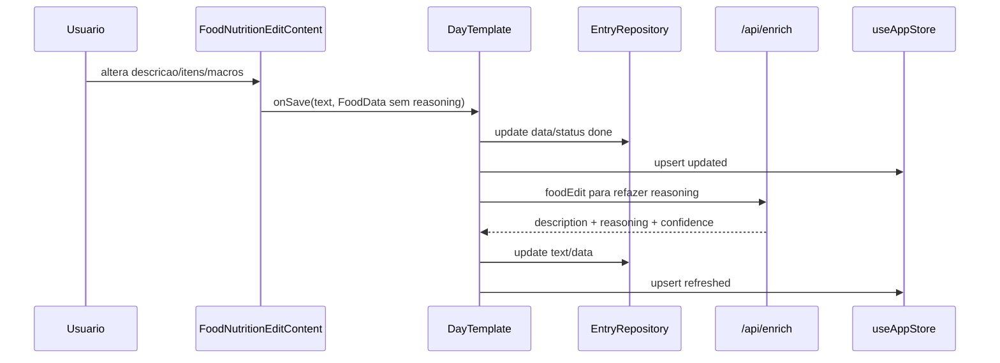

Se o usuario abrir e fechar sem mudar nada, nao deve refazer o raciocinio.
Campos de acucar/fibras/sodio aparecem nos totais e itens somente quando estao
ativos no perfil.

## 9. Editar com IA

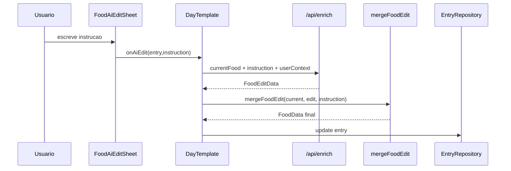

Regras de UX:

- Input fica acima do teclado.
- Enviar nao deve fechar teclado.
- Pode aplicar multiplas edicoes em um unico prompt.
- Raciocinio deve ser refeito do zero para a refeicao final, sem mencionar "eu adicionei".
- Quando micronutrientes estao ativos, a IA deve preservar ou recalcular
  `sugarG`, `fiberG` e `sodiumMg`.

## 10. Treino

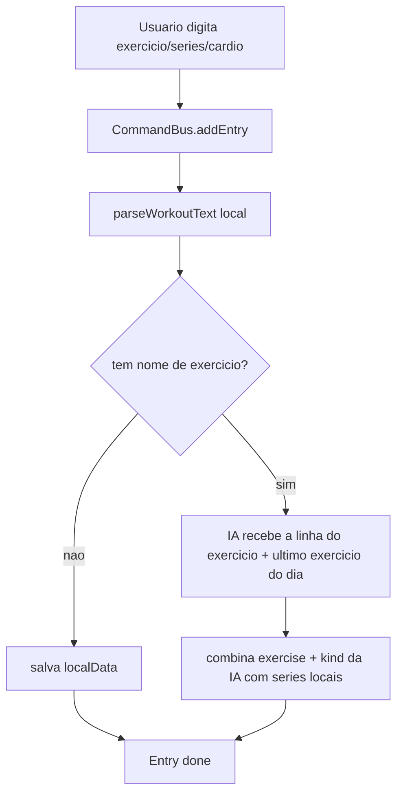

Series sao sempre calculadas localmente e nunca sao enviadas para a IA. O
payload leva a linha do exercicio em `text` mais `context`: o nome do ultimo
exercicio ja registrado no dia visivel (`CommandBus.lastExercise`), que a rota
injeta no prompt como `Context: current exercise is "..."`. Da resposta o app
aproveita apenas `exercise` e `kind`; qualquer `sets` que a IA devolva e
descartado.

Se a IA falhar, responder erro ou devolver JSON que nao valida, o app cai para
o `localData` e a entrada fica `done` do mesmo jeito. Treino nunca fica preso em
`error` por causa da IA.

Cache: a chave de treino e montada sobre o texto ja normalizado por
`normalizeForEnrich`, nao sobre o texto cru. Entao `sipini`, `supini` e `supino`
colidem na mesma entrada de cache de proposito — a correcao ja aconteceu antes
do hash. A chave nao inclui o `context`, entao o mesmo texto reaproveita o
resultado mesmo que o exercicio anterior do dia tenha mudado.

### Series e cardio na mesma estrutura

`parseWorkoutSetLine` tenta cardio e forca na mesma linha:

| Linha | Resultado |
| --- | --- |
| `100x8` | `{ weight: 100, unit: "kg", reps: 8 }` |
| `95 kg x 7` | `{ weight: 95, unit: "kg", reps: 7 }` |
| `20 reps` | `{ reps: 20 }` |
| `15 repeticoes` | `{ reps: 15 }` |
| `5km` | `{ distanceMeters: 5000 }` |
| `500 m` | `{ distanceMeters: 500 }` |
| `30 min` | `{ durationSeconds: 1800 }` |
| `1h30` | `{ durationSeconds: 5400 }` |
| `10:30` | `{ durationSeconds: 630 }` |
| `1h/5km` | `{ durationSeconds: 3600, distanceMeters: 5000 }` |
| `5km 30 min 20 reps` | `{ distanceMeters: 5000, durationSeconds: 1800, reps: 20 }` |

Regras do parser:

- Quando a linha tem metrica de cardio, as partes de tempo/distancia sao
  removidas antes de tentar ler carga, para `5 km` nao virar peso 5.
- Unidade explicita (`kg`/`lb`) ou `x` forcam leitura como serie de carga.
- Repeticao sozinha precisa da palavra: `20 reps` ou `15 repeticoes` viram
  `{ reps }`. Um numero solto sem `x`, unidade ou palavra nao vira serie.
- A ultima unidade explicita e carregada para as linhas seguintes.
- A primeira linha pode conter exercicio e metrica juntos; `getWorkoutExerciseLine`
  tira as metricas e devolve so o nome.

`inferWorkoutKind` decide o `kind` localmente: metrica de cardio sem carga vira
`cardio`, nome que casa com corrida/bike/natacao/esteira/HIIT vira `cardio`, o
resto vira `strength`. A IA pode sobrescrever esse palpite.

## 11. Progresso e PR do Treino

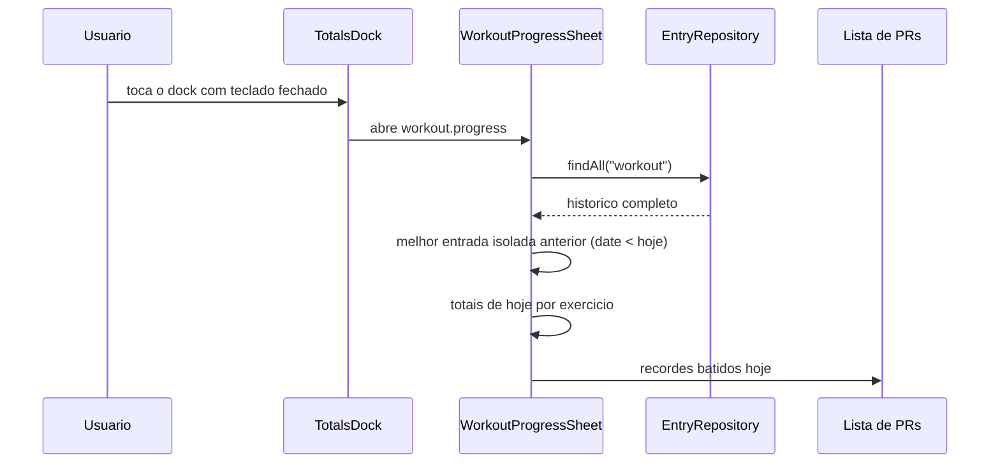

Como o PR e apurado:

- so entram entradas `done` com `WorkoutData`;
- o historico e filtrado por `entry.date < date` — o proprio dia nunca entra na
  marca a bater;
- entradas do mesmo exercicio **de hoje** sao somadas entre si antes de
  comparar (`buildTodayTotals` usa `combineTotals`);
- a marca anterior **nao** e somada por dia: e o melhor valor de uma entrada
  isolada (`buildPreviousBests` usa `Math.max` por entrada). Uma sessao passada
  dividida em varias entradas deixa a marca a bater mais baixa do que se
  tivesse sido registrada de uma vez so;
- volume, distancia e duracao viram PR quando ficam **acima** do melhor
  anterior; pace vira PR quando fica **abaixo**;
- sem marca anterior, o item aparece como `Primeiro registro`;
- pace so aparece quando existe marca anterior de pace para comparar;
- a lista corta em 6 itens.

O painel recarrega o historico toda vez que fica visivel. Nao ha cache.

## 12. Exercicios Salvos

Dois jeitos de criar um template:

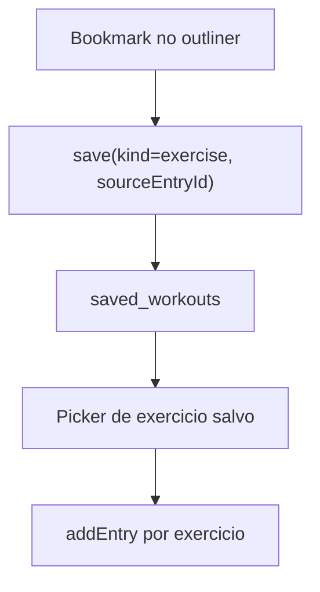

Salvar:

- o bookmark do outliner so aparece em entrada `done` e salva um exercicio,
  ligado a `Entry` por `sourceEntryId`;
- o bookmark e alternavel nos dois sentidos: tocar num bookmark preenchido
  chama `deleteBySourceEntryId` e **apaga o template de vez**, sem confirmacao
  e sem undo;
- o estado preenchido nao e da sessao. `DayTemplate` recarrega
  `SavedExerciseRepository.all()` a cada mudanca de dia ou de entradas e monta
  `savedWorkoutEntryIds`, entao o bookmark continua preenchido depois de
  fechar o app;
- salvar o dia inteiro nao mora mais aqui: virou o botao do header, gravando
  em `saved_routines`. `kind = day` continua legivel, mas ninguem escreve;
- a UI e otimista: o icone marca na hora e reverte se o repository devolver
  falso ou lancar;
- salvar de novo a mesma origem nao duplica, os indices unicos parciais
  garantem isso e `save` devolve o registro existente.

Reaplicar:

- com o teclado aberto na tela de treino, o `+` abre o picker;
- o picker e multi-selecao: escolhe varios templates e confirma no check;
- cada exercicio de cada template vira uma `Entry` nova, via `addEntry`;
- so o nome volta. Series ficam em branco para o usuario preencher.

Apagar, dois caminhos:

- desmarcar o bookmark na entrada de origem (so alcanca template de exercicio);
- a lixeira em Ajustes > Treinos > Treinos salvos (alcanca exercicio e dia).

## 13. Undo e Retry

Undo:

1. Delete chama `CommandBus.deleteEntry`, que **devolve o comando**.
2. Entrada sai do repository e da store.
3. `UndoToast` aparece por 4 segundos, ja carregando esse comando.
4. Undo passa o comando de volta: `CommandBus.undo(comando)` so desempilha se
   ele ainda for o topo. Se o usuario fez outra coisa depois (adicionou nota,
   editou), o undo devolve `null` e nao mexe em nada.

O bus e singleton compartilhado por dieta e treino, entao sem esse vinculo o
toast de uma tela desfaria a acao da outra. A pilha guarda no maximo 20
comandos.

Retry:

1. Entrada em `error` mostra `tentar de novo`.
2. Tap limpa tentativas e status vira `thinking`.
3. `CommandBus` reexecuta enriquecimento.
