# Build e instalação do Gym no iPhone sem Apple Developer pago

> **Projeto:** Gym / GymNotes  
> **Repositório:** `ompo-dev/Gym`  
> **Última atualização:** 21 de julho de 2026  
> **Status:** fluxo testado com sucesso em iPhone físico  
> **Método:** GitHub Actions gera um IPA sem assinatura; Sideloadly assina e instala usando uma Apple Account gratuita.

---

## 1. Objetivo desta documentação

Este documento descreve o fluxo completo utilizado para:

1. validar o projeto Expo/React Native;
2. gerar o projeto nativo iOS;
3. compilar o aplicativo em um runner macOS do GitHub Actions;
4. empacotar o `.app` em um `.ipa` sem assinatura;
5. baixar o artefato produzido;
6. assinar e instalar o IPA no iPhone pelo Sideloadly;
7. renovar a assinatura antes da expiração;
8. diagnosticar falhas de instalação e crashes;
9. preservar os dados locais durante atualizações;
10. manter registradas as limitações da Apple Account gratuita.

Este processo serve para **desenvolvimento e testes pessoais em dispositivo físico**. Ele não substitui TestFlight nem publicação na App Store.

---

## 2. Visão geral do fluxo

```mermaid
flowchart LR
    A[Código Expo/React Native] --> B[Commit e push]
    B --> C[GitHub Actions]
    C --> D[Expo prebuild iOS]
    D --> E[CocoaPods]
    E --> F[Xcode Release sem assinatura]
    F --> G[Gym-unsigned.ipa]
    G --> H[Download no Windows]
    H --> I[Sideloadly]
    I --> J[Assinatura com Apple Account]
    J --> K[Instalação no iPhone]
```



### Divisão de responsabilidades

| Componente              | Responsabilidade                                            |
| ----------------------- | ----------------------------------------------------------- |
| Expo                    | Gerar e configurar o projeto nativo iOS                     |
| CocoaPods               | Instalar as dependências nativas                            |
| Xcode no GitHub Actions | Compilar o aplicativo para iPhone                           |
| GitHub Actions          | Automatizar o build e disponibilizar artefatos              |
| Sideloadly              | Criar a assinatura de desenvolvimento e instalar o IPA      |
| Apple Account           | Emitir o perfil gratuito de desenvolvimento                 |
| iPhone                  | Validar o perfil, confiar no desenvolvedor e executar o app |

### O que este fluxo não faz

- Não envia o aplicativo para a App Store.
- Não envia o aplicativo para o TestFlight.
- Não gera um IPA assinado para distribuição pública.
- Não elimina as limitações da Apple Account gratuita.
- Não torna o aplicativo instalável por qualquer pessoa.
- Não requer uma assinatura paga do Apple Developer Program para uso pessoal.

---

## 3. Ambiente atualmente validado

### Projeto

| Dependência             | Versão validada |
| ----------------------- | --------------: |
| Expo SDK                |       `54.0.36` |
| React Native            |        `0.81.5` |
| React                   |        `19.1.0` |
| Expo Router             |        `6.0.24` |
| React Native Reanimated |         `4.1.1` |
| React Native Worklets   |         `0.5.1` |
| Expo SQLite             |       `16.0.10` |
| `@expo/ui`              |  `0.2.0-beta.9` |

### Build no GitHub

| Componente              | Configuração           |
| ----------------------- | ---------------------- |
| Runner                  | `macos-26-intel`       |
| Node.js                 | `22`                   |
| Xcode                   | `26.6`                 |
| Configuração            | `Release`              |
| Destino                 | `generic/platform=iOS` |
| Assinatura no build     | Desativada             |
| Timeout do job          | 60 minutos             |
| Timeout do `xcodebuild` | 50 minutos             |
| Retenção dos artefatos  | 7 dias                 |

### Instalação local

| Componente            | Versão/condição validada                        |
| --------------------- | ----------------------------------------------- |
| Sistema do computador | Windows 10 ou 11, 64 bits                       |
| Sideloadly            | `0.60.0` no momento desta documentação          |
| iTunes                | Versão web tradicional `12.10.11`, 64 bits      |
| iCloud                | Versão web tradicional indicada pelo Sideloadly |
| Dispositivo testado   | iPhone 15                                       |
| Modo de Desenvolvedor | Ativado                                         |

> As versões do Sideloadly e do iOS podem mudar. Antes de reinstalar as ferramentas, consulte o site oficial.

---

## 4. Arquivos importantes do projeto

| Arquivo                                         | Função                                             |
| ----------------------------------------------- | -------------------------------------------------- |
| `.github/workflows/gerar-ipa-ios.yml`           | Workflow que compila e empacota o IPA              |
| `app.json`                                      | Configuração Expo, nome, ícone e bundle identifier |
| `package.json`                                  | Dependências e scripts                             |
| `package-lock.json`                             | Versões exatas instaladas pelo `npm ci`            |
| `src/components/onboarding/onboardingNative.ts` | Carregamento opcional do ExpoUI e kill switch      |
| `xcodebuild.log`                                | Log completo da compilação gerado no workflow      |

O identificador original configurado no projeto é:

```text
com.ompinho.gymnotes
```

Evite alterar esse identificador sem necessidade. Mudanças de bundle ID podem fazer o iPhone considerar o build como outro aplicativo, criar outro App ID e impedir a atualização por cima da instalação anterior.

---

## 5. Pré-requisitos no Windows

### 5.1 Programas necessários

Instale as versões web tradicionais, não as versões da Microsoft Store:

- **Sideloadly para Windows 64 bits**  
  https://sideloadly.io/SideloadlySetup64.exe

- **Página oficial do Sideloadly**  
  https://sideloadly.io/

- **iTunes web para Windows 64 bits**  
  https://www.apple.com/itunes/download/win64

- **Página oficial do iTunes 12.10.11**  
  https://support.apple.com/en-us/106372

- **iCloud web tradicional indicado pelo Sideloadly**  
  https://updates.cdn-apple.com/2020/windows/001-39935-20200911-1A70AA56-F448-11EA-8CC0-99D41950005E/iCloudSetup.exe

### 5.2 Ordem recomendada de instalação

1. Desinstale as versões do iTunes e iCloud obtidas pela Microsoft Store.
2. Reinicie o Windows.
3. Instale o iTunes web tradicional.
4. Instale o iCloud web tradicional.
5. Instale ou atualize o Sideloadly.
6. Reinicie o computador.
7. Abra o iTunes.
8. Conecte o iPhone por um cabo com suporte a dados.
9. Desbloqueie o iPhone.
10. Toque em **Confiar neste computador**.
11. Confirme que o iPhone aparece no iTunes.
12. Faça uma sincronização simples.
13. Feche o iTunes antes de iniciar o sideload.

> O iTunes pode ser aberto novamente durante diagnósticos, mas evite iniciar uma sincronização enquanto o Sideloadly estiver instalando o app.

### 5.3 Serviço necessário no Windows

O serviço **Apple Mobile Device Service** deve estar ativo.

Para reiniciá-lo:

1. pressione `Win + R`;
2. execute `services.msc`;
3. localize **Apple Mobile Device Service**;
4. defina o tipo de inicialização como **Automático**;
5. clique em **Parar**;
6. clique em **Iniciar**;
7. reconecte o iPhone.

---

## 6. Preparação do iPhone

### 6.1 Confiar no computador

Ao conectar o dispositivo:

1. desbloqueie o iPhone;
2. toque em **Confiar**;
3. informe o código do aparelho;
4. mantenha a tela desbloqueada durante a instalação.

Quando a relação de confiança estiver corrompida:

```text
Ajustes
→ Geral
→ Transferir ou Redefinir iPhone
→ Redefinir
→ Redefinir Localização e Privacidade
```

Depois:

1. reinicie o iPhone;
2. reinicie o Windows;
3. reconecte o cabo;
4. toque novamente em **Confiar**.

### 6.2 Ativar o Modo de Desenvolvedor

Caminho esperado:

```text
Ajustes
→ Privacidade e Segurança
→ Modo de Desenvolvedor
→ Ativar
```

O iPhone reinicia. Após ligar novamente:

1. desbloqueie o aparelho;
2. confirme a ativação;
3. informe o código.

O Modo de Desenvolvedor é necessário para executar aplicativos assinados para desenvolvimento e instalados fora da App Store.

### 6.3 Confiar na Apple Account usada no Sideloadly

Após instalar o app:

```text
Ajustes
→ Geral
→ VPN e Gerenciamento de Dispositivo
```

Na seção de aplicativo de desenvolvedor:

1. toque no e-mail usado no Sideloadly;
2. toque em **Confiar**, **Verificar Aplicativo** ou opção equivalente;
3. mantenha o iPhone conectado à internet durante a verificação.

Os nomes das opções podem variar conforme a versão do iOS.

---

## 7. Checklist antes de gerar um novo IPA

Execute no diretório do projeto:

```powershell
npm ci
npm run typecheck
npm run lint
npm test
npx expo-doctor
```

### Resultado esperado

- `npm ci`: conclui sem alterar o lockfile;
- `typecheck`: nenhum erro TypeScript;
- `lint`: nenhum erro bloqueante;
- testes: aprovados;
- `expo-doctor`: todos os checks aprovados.

### Verifique as alterações antes do push

```powershell
git status
git diff
```

Depois:

```powershell
git add .
git commit -m "descrição da alteração"
git push
```

> O workflow executa `npx expo-doctor || true`, portanto avisos do Expo Doctor aparecem no log, mas não interrompem o build. Por isso, o `npx expo-doctor` local deve ser tratado como verificação obrigatória.

---

## 8. Como iniciar o workflow no GitHub

O workflow usa `workflow_dispatch`, então ele é iniciado manualmente.

1. Abra o repositório `ompo-dev/Gym`.
2. Entre na aba **Actions**.
3. Selecione **Gerar IPA para iPhone**.
4. Clique em **Run workflow**.
5. Escolha a branch desejada.
6. Confirme em **Run workflow**.
7. Abra a execução criada.
8. Acompanhe o job `gerar-ipa`.

### Tempo esperado

O tempo varia conforme cache e disponibilidade do runner. No teste validado, a execução levou aproximadamente 25 minutos.

O workflow possui:

```yaml
timeout-minutes: 60
```

A etapa de compilação possui:

```yaml
timeout-minutes: 50
```

Se o build exceder esses limites, o GitHub interromperá a execução.

---

## 9. O que o workflow faz

Arquivo fonte:

```text
.github/workflows/gerar-ipa-ios.yml
```

### 9.1 Baixa o repositório

```yaml
uses: actions/checkout@v6
```

O runner recebe exatamente o código presente no commit/branch selecionado.

### 9.2 Configura Node.js 22

```yaml
uses: actions/setup-node@v7
node-version: 22
cache: npm
```

O cache do npm reduz downloads repetidos, mas o `npm ci` continua usando o `package-lock.json` como fonte da verdade.

### 9.3 Seleciona o Xcode 26.6

```bash
sudo xcode-select \
  --switch /Applications/Xcode_26.6.app/Contents/Developer
```

O workflow imprime:

- versão do Xcode;
- versão do SDK do iOS;
- arquitetura do runner.

Isso ajuda a comparar builds futuros.

### 9.4 Restaura o cache do CocoaPods

São armazenados:

```text
~/Library/Caches/CocoaPods
~/.cocoapods/repos
```

A chave considera:

```text
sistema + arquitetura + package-lock.json + app.json
```

Alterações nesses arquivos tendem a gerar uma chave de cache nova.

### 9.5 Instala dependências JavaScript

```bash
npm ci
```

`npm ci`:

- exige um `package-lock.json` válido;
- instala as versões determinadas pelo lockfile;
- remove instalações anteriores no runner;
- é mais previsível que `npm install` para CI.

### 9.6 Verifica a configuração Expo

```bash
npx expo config --type public
npx expo-doctor || true
```

A configuração final do Expo aparece no log.

O `|| true` impede que o Expo Doctor encerre o job. Isso é útil para registrar avisos, mas exige que a validação estrita seja feita localmente antes do push.

### 9.7 Gera o projeto nativo iOS

```bash
npx expo prebuild \
  --platform ios \
  --clean \
  --no-install
```

Significado:

- `--platform ios`: gera apenas o projeto iOS;
- `--clean`: recria a pasta nativa para evitar resíduos;
- `--no-install`: não executa automaticamente a instalação dos pods.

Como o prebuild é limpo, alterações manuais feitas diretamente dentro da pasta `ios/` podem ser apagadas. Configurações persistentes devem ficar em `app.json`, config plugins ou código de automação.

### 9.8 Instala os pods

```bash
cd ios
pod install
```

O CocoaPods integra dependências nativas como Expo modules, SQLite, Reanimated, câmera e outras bibliotecas.

### 9.9 Detecta workspace e scheme

O workflow procura o primeiro arquivo:

```text
ios/*.xcworkspace
```

Depois usa o nome do workspace como scheme e valida com:

```bash
xcodebuild -workspace "$WORKSPACE" -list
```

### 9.10 Compila em Release para iPhone

Comando principal:

```bash
xcodebuild \
  -workspace "$WORKSPACE" \
  -scheme "$SCHEME" \
  -configuration Release \
  -sdk iphoneos \
  -destination "generic/platform=iOS" \
  -derivedDataPath "$PWD/build" \
  -parallelizeTargets \
  -jobs 4 \
  CODE_SIGNING_ALLOWED=NO \
  CODE_SIGNING_REQUIRED=NO \
  CODE_SIGN_IDENTITY="" \
  COMPILER_INDEX_STORE_ENABLE=NO \
  DEBUG_INFORMATION_FORMAT=dwarf \
  GCC_GENERATE_DEBUGGING_SYMBOLS=NO \
  ONLY_ACTIVE_ARCH=YES \
  build
```

### Por que a assinatura é desativada?

O GitHub Actions não possui:

- certificado de desenvolvimento da Apple;
- perfil de provisionamento;
- Apple Account configurada;
- registro do iPhone.

Por isso o Xcode apenas compila o aplicativo:

```text
CODE_SIGNING_ALLOWED=NO
CODE_SIGNING_REQUIRED=NO
CODE_SIGN_IDENTITY=""
```

O resultado não pode ser instalado diretamente. A assinatura é feita depois pelo Sideloadly.

### 9.11 Localiza o `.app`

O arquivo compilado é procurado em:

```text
build/Build/Products/Release-iphoneos/*.app
```

### 9.12 Empacota o `.ipa`

A estrutura de um IPA contém:

```text
Payload/
└── Gym.app/
```

O workflow:

1. cria `ipa-package/Payload`;
2. copia o `.app`;
3. compacta a pasta `Payload`;
4. produz:

```text
Gym-unsigned.ipa
```

### 9.13 Publica os artefatos

#### IPA

```text
Gym-iOS-unsigned
```

Contém o IPA sem assinatura.

#### Log

```text
Gym-iOS-build-log
```

Contém:

```text
xcodebuild.log
```

O log é enviado mesmo quando a compilação falha, desde que tenha sido criado.

---

## 10. Download dos artefatos

Ao finalizar o workflow:

1. abra a execução;
2. role até **Artifacts**;
3. baixe `Gym-iOS-unsigned`;
4. opcionalmente baixe `Gym-iOS-build-log`;
5. extraia o ZIP do artefato;
6. localize o arquivo `*-unsigned.ipa`.

### Prazo do artefato no GitHub

O workflow define:

```yaml
retention-days: 7
```

Isso significa que o arquivo fica disponível no GitHub por **7 dias** após a execução.

### Importante: são dois prazos diferentes

| Prazo                         | O que expira                             |
| ----------------------------- | ---------------------------------------- |
| 7 dias do artefato            | O download hospedado no GitHub           |
| 7 dias da assinatura gratuita | A autorização do app instalado no iPhone |

Esses prazos são independentes.

### O IPA salvo no computador expira?

O IPA sem assinatura salvo localmente não possui o perfil gratuito criado pelo Sideloadly. Portanto, o desaparecimento do artefato no GitHub não apaga nem invalida a cópia já baixada.

Quando apenas a assinatura instalada no iPhone expirar, é possível reutilizar o mesmo IPA local e assiná-lo novamente. Um novo build no GitHub é necessário somente quando:

- o código mudou;
- dependências mudaram;
- configurações nativas mudaram;
- o IPA local foi perdido;
- deseja-se gerar um binário atualizado.

---

## 11. Instalação pelo Sideloadly

### 11.1 Antes de começar

Confirme:

- iPhone desbloqueado;
- cabo com transferência de dados;
- iPhone visível no iTunes;
- computador confiável;
- Modo de Desenvolvedor ativado;
- internet ativa;
- espaço livre no PC e no iPhone;
- Sideloadly atualizado;
- IPA extraído do ZIP.

### 11.2 Procedimento

1. Abra o Sideloadly.
2. Conecte o iPhone.
3. Aguarde o dispositivo aparecer no seletor.
4. Arraste o arquivo `.ipa` para a janela.
5. Selecione o iPhone correto.
6. Informe a Apple Account.
7. Mantenha as opções avançadas no padrão, salvo necessidade documentada.
8. Não altere manualmente o bundle ID durante uma atualização normal.
9. Clique em **Start**.
10. Conclua o código de autenticação em dois fatores, quando solicitado.
11. Mantenha o iPhone desbloqueado durante envio e instalação.
12. Aguarde a mensagem de sucesso.
13. Confie no desenvolvedor no iPhone.
14. Abra o aplicativo.

### Senha da Apple Account

Para uma conta gratuita, siga o fluxo normal de login e autenticação em dois fatores oferecido pelo Sideloadly.

Uma senha específica de app não é a solução padrão para contas gratuitas. Segundo o FAQ do Sideloadly, esse tipo de senha funciona somente em uma configuração específica com conta paga e Anisette desativado.

### Dados enviados

De acordo com a política do Sideloadly:

- Apple ID e senha são enviados aos servidores da Apple;
- usando Remote Anisette, o servidor do Sideloadly pode receber IP, sistema operacional e versão do Sideloadly;
- não publique logs sem ocultar e-mail, UDID e outras informações sensíveis.

---

## 12. Limites da Apple Account gratuita

A Apple chama a equipe associada à conta gratuita de **Personal Team**.

| Limitação                       |               Conta gratuita |
| ------------------------------- | ---------------------------: |
| Validade do perfil instalado    |                       7 dias |
| Apps instalados por dispositivo |                        Até 3 |
| App IDs registrados             | Até 10 por período de 7 dias |
| Dispositivos registrados        |  Até 3 por período de 7 dias |
| Distribuição pública            |                          Não |
| TestFlight/App Store            |          Exige programa pago |

### O que acontece depois de 7 dias?

O aplicativo pode continuar aparecendo na tela inicial, mas deixará de abrir porque o perfil de provisionamento expirou.

A correção é:

1. abrir o Sideloadly;
2. usar o mesmo IPA;
3. usar a mesma Apple Account;
4. usar o mesmo bundle ID;
5. instalar novamente por cima do app existente.

### Quando renovar?

Não espere o último minuto. Para reduzir o risco de expiração:

```text
Renovação manual recomendada: a cada 5 ou 6 dias
```

### Limite de 3 apps

O limite conta aplicativos instalados com perfil gratuito. Quando aparecer:

```text
This device has reached the maximum number of installed apps
using a free developer profile
```

Remova outro aplicativo instalado por sideload ou use uma conta/programa apropriado.

### Limite de 10 App IDs

Cada bundle ID novo pode consumir um App ID.

Quando aparecer:

```text
Your maximum App ID limit has been reached.
You may create up to 10 App IDs every 7 days.
```

As opções são:

- aguardar a janela de 7 dias;
- evitar criar bundle IDs diferentes em testes;
- usar outra Apple Account para um ambiente separado.

Não altere o bundle ID repetidamente para tentar corrigir uma instalação.

---

## 13. Atualização sem perder os dados

Para instalar uma versão nova por cima da atual:

1. gere ou obtenha o novo IPA;
2. use a mesma Apple Account;
3. mantenha o mesmo bundle ID;
4. instale pelo Sideloadly sem apagar o app primeiro.

O Sideloadly informa que consegue sobrescrever a instalação quando a Apple Account e o bundle ID são mantidos.

### Regra prática

```text
Mesma Apple Account + mesmo bundle ID + instalação por cima
= maior chance de preservar o contêiner de dados
```

### Não confundir atualização com reinstalação limpa

| Ação                 | Efeito esperado                                     |
| -------------------- | --------------------------------------------------- |
| Instalar por cima    | Atualiza o binário e tende a preservar dados        |
| Apagar o app         | Remove o app e normalmente remove seus dados locais |
| Trocar bundle ID     | Instala como outro aplicativo                       |
| Trocar Apple Account | Pode impedir a substituição da assinatura anterior  |

Como o Gym utiliza armazenamento local, faça backup de qualquer informação importante antes de testes de migração, troca de bundle ID ou remoção do app.

---

## 14. Renovação automática pelo Sideloadly

O Sideloadly possui um daemon de auto-refresh.

### Requisitos

- Sideloadly Daemon ativo no Windows;
- iPhone conectado por USB ou disponível pelo Wi-Fi;
- computador ligado;
- iPhone e computador na mesma rede para o modo Wi-Fi;
- sincronização Wi-Fi habilitada no iTunes;
- app inscrito no auto-refresh;
- mesma Apple Account utilizada na instalação.

### Habilitar sincronização Wi-Fi

No iTunes:

```text
iPhone
→ Resumo
→ Opções
→ Sincronizar com este iPhone via Wi-Fi
→ Aplicar/Sincronizar
```

### Limitação prática

O auto-refresh reduz o trabalho manual, mas depende de o computador e o iPhone se encontrarem antes da expiração. Mantenha uma rotina manual de verificação e não trate o daemon como garantia absoluta.

---

## 15. Problema conhecido do ExpoUI no Gym

### Sintoma observado

O IPA:

- instalava corretamente;
- aparecia na tela inicial;
- passava pela confiança do desenvolvedor;
- iniciava;
- fechava quase instantaneamente.

O relatório `.ips` mostrou um `SIGABRT` durante a inicialização de módulos nativos do React Native.

### Isolamento realizado

O carregamento do módulo nativo `ExpoUI` foi desativado por um kill switch:

```ts
const ENABLE_EXPO_UI = false;
```

O carregamento somente ocorre quando a flag permitir:

```ts
if (
  !ENABLE_EXPO_UI ||
  Platform.OS !== "ios" ||
  !requireOptionalNativeModule("ExpoUI")
) {
  return null;
}
```

### Resultado

Com o caminho do ExpoUI desativado:

- o aplicativo abriu;
- o restante das funcionalidades funcionou;
- os componentes envolvidos utilizaram fallbacks React Native existentes;
- a New Architecture permaneceu ativada;
- Reanimated 4 e Worklets permaneceram intactos.

### Regra atual

```text
Não reativar ENABLE_EXPO_UI sem um build de teste separado.
```

### Procedimento futuro para reativação

1. atualizar Expo SDK e `@expo/ui`;
2. criar uma branch específica;
3. executar `expo-doctor`, typecheck e testes;
4. definir `ENABLE_EXPO_UI = true`;
5. gerar novo IPA;
6. instalar sem substituir o build estável, usando ambiente/bundle ID de teste quando apropriado;
7. coletar novo `.ips` em caso de crash;
8. somente integrar após teste completo.

### Não desativar a New Architecture

O projeto utiliza:

```text
react-native-reanimated 4.x
react-native-worklets 0.5.x
```

Reanimated 4 depende da New Architecture. Alterar `newArchEnabled` para `false` não é um teste isolado: exigiria migração para Reanimated 3 e revisão do Worklets.

---

## 16. Como coletar um relatório de crash no iPhone

Quando o app abre e fecha:

1. reproduza o problema duas ou três vezes;
2. aguarde alguns segundos;
3. abra:

```text
Ajustes
→ Privacidade e Segurança
→ Análise e Melhorias
→ Dados de Análise
```

4. procure o arquivo mais recente com o nome do app:

```text
Gym-AAAA-MM-DD-HHMMSS.ips
```

5. abra o arquivo;
6. compartilhe ou salve em Arquivos;
7. mantenha também o `xcodebuild.log` do build correspondente.

### Arquivos `JetsamEvent`

`JetsamEvent` normalmente está associado a encerramento por pressão de memória. Use apenas arquivos com data próxima ao teste. Um JetsamEvent antigo não explica necessariamente o crash atual.

### Campos úteis no `.ips`

Procure por:

```text
exception
termination
signal
faultingThread
triggeredThread
lastExceptionBacktrace
terminationReason
```

Indicadores comuns:

| Indicador                | Possível categoria                 |
| ------------------------ | ---------------------------------- |
| `Namespace DYLD`         | Biblioteca ausente ou incompatível |
| `Code Signature Invalid` | Problema de assinatura             |
| `SIGABRT`                | Exceção fatal/abort                |
| `EXC_BAD_ACCESS`         | Acesso inválido à memória          |
| `RCTFatal`               | Erro fatal do React Native         |
| `JetsamEvent`            | Pressão de memória                 |
| `Library not loaded`     | Framework não encontrado           |

---

## 17. Solução de problemas

### 17.1 Sideloadly não detecta o iPhone

Faça, nesta ordem:

1. desbloqueie o iPhone;
2. teste outro cabo de dados;
3. teste outra porta USB;
4. abra o iTunes e confirme que o aparelho aparece;
5. aceite **Confiar neste computador**;
6. feche o iTunes;
7. reinicie o Apple Mobile Device Service;
8. reinicie Windows e iPhone;
9. confirme que iTunes/iCloud são as versões web, não Microsoft Store.

### 17.2 `LOCKDOWN_E_INVALID_CONF` ou erro de handshake

Indica problema na comunicação/pareamento entre Windows e iPhone.

1. desconecte o aparelho;
2. redefina Localização e Privacidade;
3. reinicie ambos;
4. conecte com o iPhone desbloqueado;
5. confie novamente;
6. abra e sincronize pelo iTunes;
7. feche o iTunes;
8. tente novamente no Sideloadly.

Não gere outro IPA apenas por causa desse erro.

### 17.3 `LOCKDOWN_E_INVALID_HOST_ID`

Confirme a confiança no computador, reinicie com o aparelho conectado e faça uma sincronização no iTunes.

### 17.4 `NP_E_CONN_FAILED` ou `AFC_E_MUX_ERROR`

Reinstale as versões web do iTunes e iCloud, reinicie o computador, sincronize o iPhone no iTunes e tente novamente.

### 17.5 `0 InstallProhibited`

Verifique:

```text
Ajustes
→ Tempo de Uso
→ Conteúdo e Privacidade
→ Compras no iTunes e App Store
→ Instalar Apps
→ Permitir
```

O nome exato pode variar conforme a versão do iOS.

### 17.6 Desenvolvedor não confiável

Abra:

```text
Ajustes
→ Geral
→ VPN e Gerenciamento de Dispositivo
→ Apple Account utilizada
→ Confiar/Verificar
```

### 17.7 App instalado, mas sem ícone

Reinicie o iPhone.

### 17.8 App abre e fecha

Não assuma que a assinatura falhou.

1. colete o `.ips`;
2. compare a data com o build;
3. verifique o `xcodebuild.log`;
4. procure módulos nativos inicializados no boot;
5. isole uma variável por build;
6. não faça várias migrações simultâneas.

### 17.9 App funcionava e parou depois de alguns dias

Provavelmente o perfil gratuito expirou.

Reassine e instale novamente com:

- mesmo IPA;
- mesma Apple Account;
- mesmo bundle ID.

### 17.10 Limite de App IDs

Aguarde a janela de 7 dias. Não continue criando identificadores diferentes.

### 17.11 Limite de 3 apps

Remova outro app instalado com perfil gratuito.

### 17.12 Erro relacionado a data, hora ou identidade inválida

Ative data e hora automáticas no Windows e no iPhone. Certificados e perfis dependem de relógios corretos.

### 17.13 `No space left on device`

No contexto do Sideloadly, também verifique o espaço livre no disco do computador, não apenas no iPhone.

### 17.14 Falha no GitHub Actions

Baixe:

```text
Gym-iOS-build-log
```

Procure no final do `xcodebuild.log` por:

```text
error:
fatal error:
BUILD FAILED
SwiftCompile
CompileC
Ld
PhaseScriptExecution
```

A primeira mensagem de erro relevante costuma ser mais útil que as mensagens em cascata apresentadas depois.

---

## 18. Manutenção do workflow

### Ao atualizar o Expo SDK

1. crie uma branch;
2. rode `npx expo install --fix`;
3. rode `npx expo-doctor`;
4. revise as versões compatíveis;
5. faça o prebuild local ou em CI;
6. compare alterações nativas;
7. gere um IPA de teste;
8. preserve o build anterior;
9. teste instalação e inicialização;
10. reavalie o kill switch do ExpoUI.

### Ao atualizar o Xcode do workflow

Revise:

```yaml
sudo xcode-select \
--switch /Applications/Xcode_XX.X.app/Contents/Developer
```

A imagem do runner precisa conter a versão configurada.

### Ao atualizar actions do GitHub

Verifique compatibilidade antes de alterar:

```yaml
actions/checkout
actions/setup-node
actions/cache
actions/upload-artifact
```

### Ao alterar dependências nativas

Atualize e versione corretamente:

```text
package.json
package-lock.json
app.json
config plugins
```

Depois gere um novo IPA. Não reutilize um binário antigo esperando que ele contenha dependências novas.

---

## 19. Segurança e boas práticas

- Não publique Apple ID, senha, códigos 2FA ou UDID.
- Ative a opção de ocultar informações sensíveis antes de compartilhar logs do Sideloadly.
- Baixe Sideloadly, iTunes e iCloud somente das fontes oficiais documentadas.
- Não instale IPAs de origem desconhecida.
- Não injete `.dylib`, `.deb` ou frameworks sem saber sua procedência.
- Mantenha backup dos dados importantes.
- Evite usar o build pessoal como mecanismo de distribuição para terceiros.
- Revogue sessões ou altere a senha caso credenciais tenham sido expostas.
- Mantenha Windows e iPhone com data e hora automáticas.
- Guarde o IPA funcional e o commit exato que o gerou.
- Associe cada relatório `.ips` ao SHA do commit e à execução do workflow.

---

## 20. Rotina operacional recomendada

### Quando há código novo

```text
1. Validar localmente
2. Commitar e enviar
3. Executar GitHub Actions
4. Baixar e arquivar IPA + log
5. Instalar por cima pelo Sideloadly
6. Fazer teste rápido de regressão
```

### Quando apenas a assinatura está perto de expirar

```text
1. Usar o IPA já salvo
2. Abrir Sideloadly
3. Usar mesma Apple Account
4. Instalar por cima
5. Confirmar abertura
```

Não é necessário executar o GitHub Actions novamente somente para renovar a assinatura.

### Teste rápido após cada instalação

- app abre sem fechar;
- onboarding ou tela principal aparece;
- navegação funciona;
- SQLite lê e salva;
- câmera/fotos pedem permissões quando utilizadas;
- dados anteriores permanecem;
- app fecha e reabre;
- app funciona depois de reiniciar o iPhone.

---

## 21. Checklist resumido

### Build

- [ ] `npm ci`
- [ ] `npm run typecheck`
- [ ] `npm run lint`
- [ ] `npm test`
- [ ] `npx expo-doctor`
- [ ] commit e push
- [ ] executar workflow manual
- [ ] baixar IPA em até 7 dias
- [ ] baixar log e guardar com o IPA

### Windows

- [ ] iTunes web instalado
- [ ] iCloud web instalado
- [ ] Sideloadly atualizado
- [ ] Apple Mobile Device Service ativo
- [ ] iPhone visível no iTunes

### iPhone

- [ ] computador confiável
- [ ] Modo de Desenvolvedor ativado
- [ ] internet ativa
- [ ] desenvolvedor confiável/verificado
- [ ] menos de 3 apps gratuitos instalados
- [ ] espaço livre suficiente

### Renovação

- [ ] renovar no 5º ou 6º dia
- [ ] usar mesma Apple Account
- [ ] manter mesmo bundle ID
- [ ] instalar por cima
- [ ] verificar preservação dos dados

---

## 22. Referências oficiais

### Projeto

- Workflow: `.github/workflows/gerar-ipa-ios.yml`
- Configuração: `app.json`
- Dependências: `package.json`
- Kill switch: `src/components/onboarding/onboardingNative.ts`

### Apple

- Developer account e limites da Personal Team:  
  https://developer.apple.com/help/account/basics/about-your-developer-account/

- Ativar o Modo de Desenvolvedor:  
  https://developer.apple.com/documentation/xcode/enabling-developer-mode-on-a-device

- Executar em dispositivos físicos:  
  https://developer.apple.com/documentation/xcode/running-your-app-on-simulated-or-physical-devices

- Instalação de IPA e dispositivos registrados:  
  https://developer.apple.com/documentation/xcode/distributing-your-app-to-registered-devices

- iTunes 12.10.11 para Windows 64 bits:  
  https://support.apple.com/en-us/106372

### Sideloadly

- Página oficial:  
  https://sideloadly.io/

- FAQ:  
  https://sideloadly.io/faq.html

- Changelog:  
  https://sideloadly.io/changelog.html

- Política de privacidade:  
  https://sideloadly.io/privacy

### GitHub Actions

- Download de artefatos:  
  https://docs.github.com/en/actions/how-tos/manage-workflow-runs/download-workflow-artifacts

- Retenção personalizada de artefatos:  
  https://docs.github.com/en/actions/tutorials/store-and-share-data
